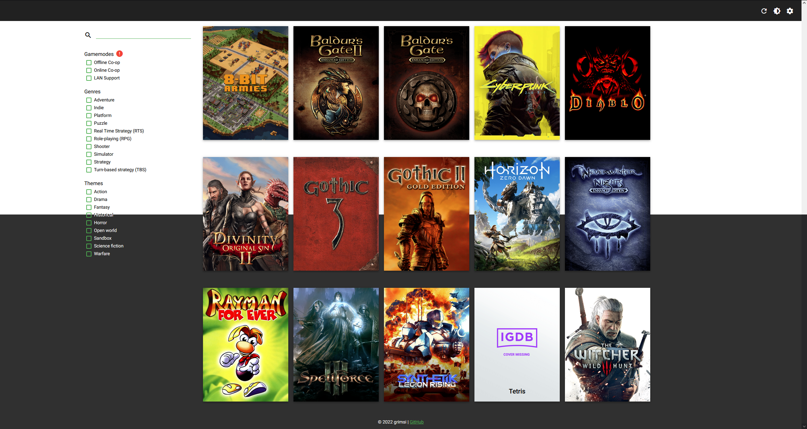
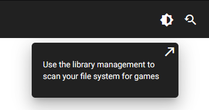
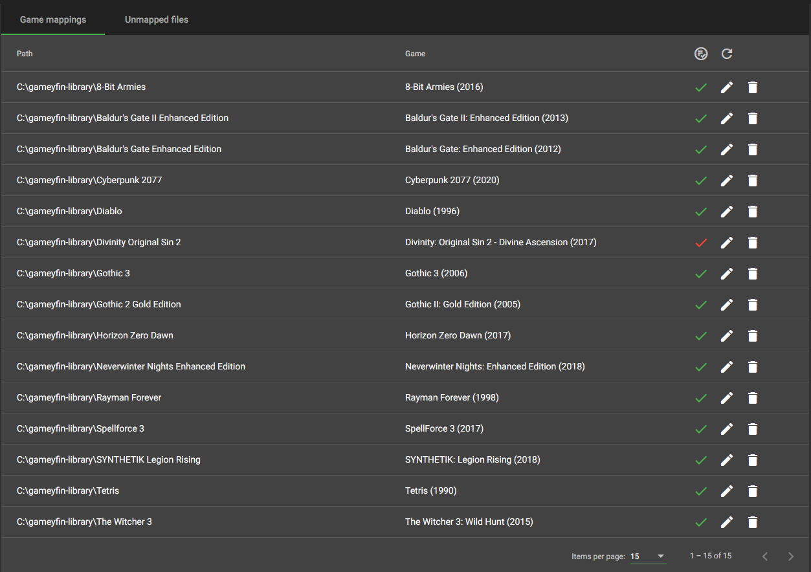
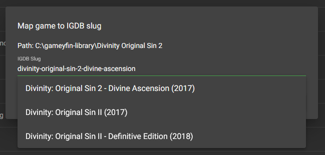

# Gameyfin
A simple game library manager.
Name and functionality inspired by [Jellyfin](https://jellyfin.org/).

## Features

* Automatically scans your game library folder
* Load additional information about the games from IGDB
* Display your library in a modern web frontend
* Download games directly from your browser
* Search and filter your game library
* Offline-friendly (once the library has been scanned everything is cached locally)
* Easy to host yourself thanks to native Docker support (alternatively it's only one .jar file to run on bare metal)
* Light and dark theme

### Differences to other game library software

In the past I used [Grifter](https://github.com/terrybrash/grifter) to manage my game library, and I was (and still am) happy with it.  
However, Grifter has some limitations that I could not work around, so I decided to develop my own app.

Grifter does not support auto-discovery of games in your library folder. Instead, you have to manually add all files and their corresponding IGDB-slugs to a config file.
Also, Grifter only supports to download one file per game. Since I also have games consisting of multiple files I was not able to download them from the browser with Grifter.
Gameyfin fixes both these limitations: It can scan your library for games and automatically match them on IGDB to load additional information.
It can also deal with games consisting of multiple files by packing them into a .zip folder in realtime if necessary.

## Installation

### General

Since Gameyfin loads information from IGDB, you need to register yourself there. Follow [this guide](https://api-docs.igdb.com/#account-creation).

### Docker

1. Download the `docker-compose.example.yml` file from this repository and rename it to just `docker-compose.yml`
2. Edit the configuration values to your liking
3. Run `docker-compose up -d`

### Bare metal

1. Make sure you have a JRE or JDK with version 18 or greater installed
2. Download the latest `gameyfin.jar` and `gameyfin.properties` file from the releases page
3. Edit the config options in the `gameyfin.properties` file
4. Use the following command to start Gameyfin: `java -jar gameyfin.jar`
5. Open the address of your Gameyfin host in your browser, Gameyfin runs under port 8080 by default

## Screenshots

### Game library screen in light mode (top) and dark mode (bottom)

### Game detail view

### Automatic library scanning

### Admin interface

### Manually fix incorrect mappings (with autocomplete suggestions)

